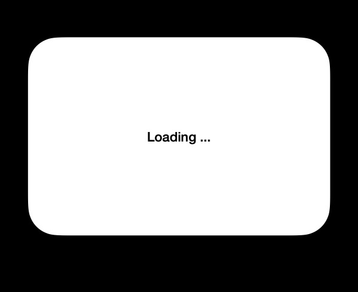
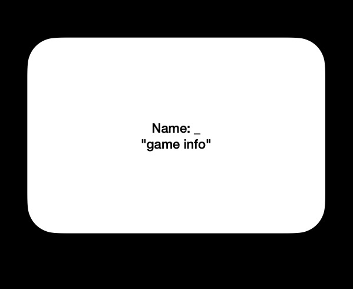
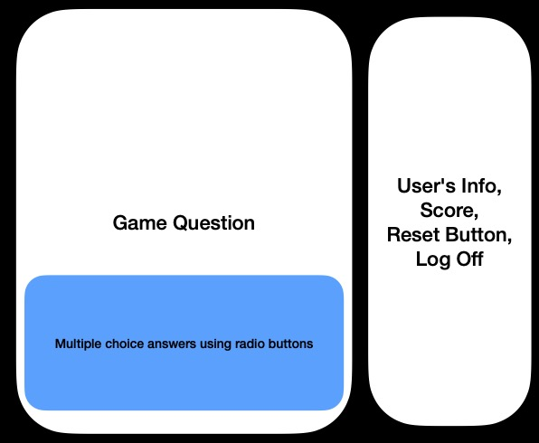
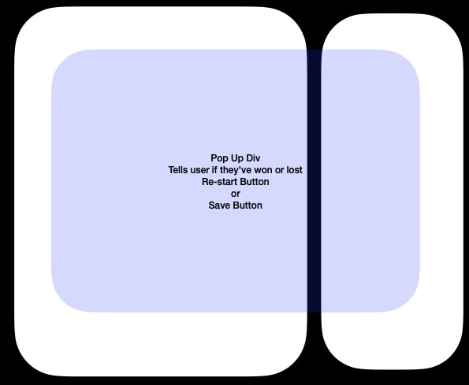

## P2, Flatiron

## Creators: Pepe Lopez, Erin Van Brunt

# Hacker's Game

### Summary:

It will be a game themed too look like what folks in the 90's though hacking looked like. This
We will be using React as a framework/library, React Router, JSON server/API, JSX, JS, HTML & CSS. The user's data will be stored in a local DB, the game questions will be in JSX. All pop up will be useState dynamic divs. All database calls
will be made using useEffect.

### User Story:

- The opening page will "load" and they read opening info about the game. The user is asked to input the
  their coding pen name.
- Once the user is in, they see the game screen. The game screen will have a coding problem that
  is written in JS and they choose from a optional choice answer below.
- When they get the answer wrong they are greeted by a pop up that leads them to start over, & reset the game.
- When they get the answer correct they move on to the next of 5 questions, while the score is still
  shown on the right of the screen.
- If all 5 questions are correct, the user is shown a leader board that will save their name and score.

### Wire Frames:

### Stretch Goals:

- CSS styling on the 90's Hackers theme.
- Accessing an online API for a 4th page, that supplies facts about the history of software development in pop-culture.
- Creating a sandbox to work in and submit answers using the Canvas element.
- Adding a Nav Bar.
- Change the game's scoring system so there is a running tally instead of a reset when a question is incorrect.
